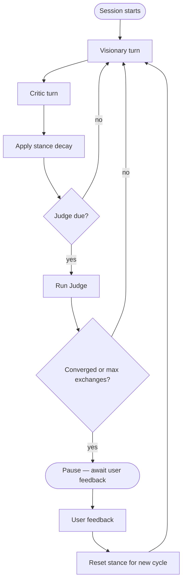

# Contributing to TerpSpark

Thank you for helping improve TerpSpark. This document explains **why** the core systems are designed the way they are — the Visionary/Critic/Judge pattern, stance decay, and the LLM fallback chain — so you can change behavior without accidentally fighting the architecture.

For setup, environment variables, ESLint, and CI, see [README.md](README.md).

---

## Architecture at a glance

TerpSpark is not a single chatbot. A **session orchestrator** (`lib/session/orchestrator.ts`) drives a turn-based loop:

1. **Visionary** streams a proposal.
2. **Critic** streams a response.
3. **Stance** shifts (decay step).
4. **Judge** may run on a schedule and pause for the user.
5. The user can **interject** between turns without stopping the cycle.

The UI receives updates over **Server-Sent Events** (SSE). Session state lives in memory during a debate and is persisted to **MongoDB** when configured (`MONGODB_URI` and related env vars).



---

## Visionary / Critic / Judge pattern

### Why three roles?

| Role | Speaks to the user? | Purpose |
| --- | --- | --- |
| **Visionary** | Yes (streamed) | Expand the idea space — propose, refine, and advocate directions. |
| **Critic** | Yes (streamed) | Contract the idea space — stress-test, surface risks, signal when an idea is strong enough to keep. |
| **Judge** | No (structured JSON only) | Decide whether the debate has converged on the target number of candidates and whether the user wants to stop. |

A single assistant tends toward agreement. Splitting **expansion** and **critique** into separate agents with separate prompts creates productive tension. The Judge stays **non-conversational** so convergence checks stay deterministic and cheap to parse (JSON), without polluting the debate transcript.

### How each agent is invoked

- **Visionary** and **Critic** call `getProvider()` and **stream** tokens via SSE (`lib/agents/visionary.ts`, `lib/agents/critic.ts`).
- **Judge** calls `getJudgeProvider()` and uses **`complete`** (non-streaming) with low temperature (`JUDGE_TEMPERATURE` in `lib/config.ts`) because it must return parseable JSON (`lib/agents/judge.ts`).

Each agent gets:

- A **system prompt** with the session topic, target idea count `{N}`, and a **stance descriptor** (see [Stance decay](#stance-decay)).
- A **windowed transcript** — the last six turns verbatim, older turns summarized (`lib/agents/window.ts`) — so context stays bounded without an extra summarization LLM call.

### Orchestration rules worth preserving

- **Turn order is fixed**: Visionary → Critic → (optional Judge). Do not run agents in parallel; the Critic must see the Visionary’s latest reply.
- **User interjections** are queued in `pendingInterjection` and inserted **between** agent turns. They do **not** trigger stance decay.
- **Display pacing**: after each agent finishes, the orchestrator waits for the client to POST `/ready` (`awaitDisplayReady`) so word-throttled UI can catch up before the next turn.
- **Judge schedule** (after each full exchange, once `MIN_EXCHANGES_BEFORE_JUDGE` is reached):
  - Every `JUDGE_EVERY_N_EXCHANGES` exchanges, or
  - When `MAX_EXCHANGES_PER_CYCLE` is hit (forces a checkpoint even without convergence).
- **Pause state**: when the Judge reports convergence (or the cycle cap is hit), the session moves to `awaiting_user`, surfaces `lastCandidates`, and waits for feedback. After feedback, stance **resets** and a new cycle begins unless the Judge detects the user is satisfied (`userSatisfied` → session ends).

When changing prompts or turn logic, keep the Judge’s JSON contract stable — the UI and orchestrator depend on `{ converged, reason, candidates, userSatisfied }`.

---

## Stance decay

### What stance represents

Each session tracks two numbers in `[0, 1]`:

| Field | Starts at | Moves over time | Meaning |
| --- | --- | --- | --- |
| `stance.visionary` | `1.0` | **Decreases** each exchange (floor `0.2`) | How bold vs pragmatic the Visionary is. |
| `stance.critic` | `0.5` | **Increases** each exchange (ceiling `1.0`) | How constructive vs adversarial the Critic is. |

Stance is **visible in the UI** (stance meter) and **injected into prompts** as a natural-language descriptor, not as a raw number the model should cite.

### Decay mechanics

After each Visionary + Critic pair, `applyDecayStep` runs (`lib/session/decay.ts`):

- `visionary -= VISIONARY_DECAY_STEP` (default `0.08`), clamped to `MIN_VISIONARY_STANCE`
- `critic += CRITIC_DECAY_STEP` (default `0.05`), clamped to `MAX_CRITIC_STANCE`

Each stance value maps to a **bucket** in `lib/config.ts` (`VISIONARY_BUCKETS`, `CRITIC_BUCKETS`). Buckets provide:

- A **descriptor** string inserted into the system prompt (e.g. “bold visionary”, “ruthless adversary”).
- A **temperature** used for that agent’s LLM call.

So the debate naturally **cools** over time: the Visionary becomes more grounded, the Critic becomes sharper. That arc prevents endless escalation and makes long sessions readable.

### Reset on user feedback

When the user responds after a Judge pause, stance resets to `RESET_VISIONARY_STANCE` / `RESET_CRITIC_STANCE` (defaults `0.75` / `0.625`) and `exchangesInCycle` goes back to `0`. The user’s feedback is appended as a turn and the Judge re-evaluates before the next cycle.

**Design intent**: decay shapes the *automatic* arc within a cycle; the user’s checkpoint reply starts a fresh arc without wiping transcript history.

### Where to tune behavior

All numeric knobs and bucket tables live in **`lib/config.ts`**. Change constants there — do not duplicate magic numbers in agents or the orchestrator.

---

## LLM provider fallback chain

### Primary provider (Visionary, Critic, and Judge fallback)

Configured in `lib/llm/index.ts`. On first use, factories are tried **in order**; the first provider whose required environment variables are set wins and is **memoized for the process lifetime**:

| Priority | Provider | Required env vars |
| --- | --- | --- |
| 1 | TerpAI | `TERPAI_API_KEY`, `TERPAI_BASE_URL` |
| 2 | Anthropic | `ANTHROPIC_API_KEY` |
| 3 | Google Gemini | `GEMINI_API_KEY` |
| 4 | OpenAI | `OPENAI_API_KEY` |
| 5 | Groq | `GROQ_API_KEY` |

**Why a chain?** TerpSpark targets UMD/TerpAI first, but contributors and deployers may only have keys for commercial APIs. One codebase should run anywhere without code changes — only env configuration.

**Why memoize?** Provider selection is logged once at startup (`[terpspark] selected LLM provider: …`). Mixing providers mid-session would split context handling and billing unpredictably.

If no provider is configured, the server still boots, but routes that need an LLM return **503** with `{ "error": "no LLM provider configured" }`.

### Judge-specific provider

The Judge uses a **separate selection path** (`getJudgeProvider`):

1. Prefer **Groq** when `GROQ_API_KEY` is set (fast, cheap structured JSON).
2. Otherwise fall back to the **same primary provider** as the agents.

Visionary and Critic always use the primary chain. Only the Judge gets this Groq-first shortcut so quota on your main model is preserved for long streamed debates.

### Adding or reordering providers

1. Implement `createXProvider(): LLMProvider | null` under `lib/llm/providers/`.
2. Export `stream` and `complete` on the shared `LLMProvider` interface (`lib/llm/types.ts`).
3. Register the factory in the `factories` array in `lib/llm/index.ts` at the desired priority.
4. Document new env vars in `.env.local.example` and [README.md](README.md).

Do not hardcode API keys or provider names in agents — always go through `getProvider()` / `getJudgeProvider()`.

---

## Persistence (MongoDB)

### Why MongoDB?

Live debates run in an in-memory `Map` (`lib/session/store.ts`) for low latency and simple orchestration locking. **MongoDB** backs durable storage for:

- **Dashboard session list** — topic, state, candidates, turn count (per `userId`)
- **Transcript reload** — individual turns with agent, text, and order (per `sessionId`)
- **Cross-request continuity** — API routes call `loadPersistedSession()` to hydrate memory when a process restarts or a session is opened from the dashboard

The client module lives at `lib/mongodb/client.ts`. It uses the official `mongodb` driver and reads:

| Env var | Default | Collection purpose |
| --- | --- | --- |
| `MONGODB_URI` | — (required) | Atlas SRV or local connection string |
| `MONGODB_DATABASE` | `ricochet` | Database name |
| `MONGODB_SESSIONS_COLLECTION` | `sessions` | Full session documents |
| `MONGODB_MESSAGES_COLLECTION` | `messages` | One document per debate turn |

### Write pattern

- **Sessions**: `replaceOne` upserts keyed on `{ id, userId }` after orchestrator updates (fire-and-forget from `persistSessionAsync`).
- **Messages**: `replaceOne` upserts keyed on `{ id, sessionId }`; `persistTurn` is awaited so turns are durable before the next agent speaks.

### Indexes

Create these once per environment for good dashboard and reload performance:

```
sessions:  { userId: 1, createdAt: -1 }
           { id: 1, userId: 1 }
messages:  { sessionId: 1, order: 1 }
           { id: 1, sessionId: 1 }
```

Without MongoDB configured, debate APIs still work in memory; `/api/sessions` and history reload return errors until `MONGODB_URI` is set.

---

## Key files

| Path | Responsibility |
| --- | --- |
| `lib/config.ts` | All tunable debate constants (stance, judge schedule, word limits, buckets). |
| `lib/session/orchestrator.ts` | Debate loop, SSE events, judge scheduling, pause/resume. |
| `lib/session/decay.ts` | Stance math and bucket lookup. |
| `lib/session/store.ts` | In-memory session state, MongoDB persistence hooks, feedback waiters. |
| `lib/mongodb/client.ts` | MongoDB client — sessions and messages collections. |
| `lib/agents/visionary.ts`, `critic.ts`, `judge.ts` | Prompts and LLM calls per role. |
| `lib/agents/window.ts` | Transcript windowing for agent context. |
| `lib/llm/index.ts` | Provider selection and caching. |
| `app/api/session/[id]/stream/route.ts` | SSE endpoint that runs the orchestrator. |

---

## Development guidelines

- **Run checks before opening a PR**: `npm run lint` and `npm run build` (CI runs build on every push — see README).
- **Keep prompts in agent files**; keep numbers in `lib/config.ts`.
- **Preserve SSE event names** (`session_init`, `agent_token`, `agent_complete`, `stance_update`, `judge_result`, `paused`, `resumed`, `ended`, …) — the client depends on them.
- **Do not commit secrets** — use `.env.local` locally; see `.env.local.example` for the full variable list.

Questions about product direction or large architectural changes are best discussed with the maintainers before a big refactor.
